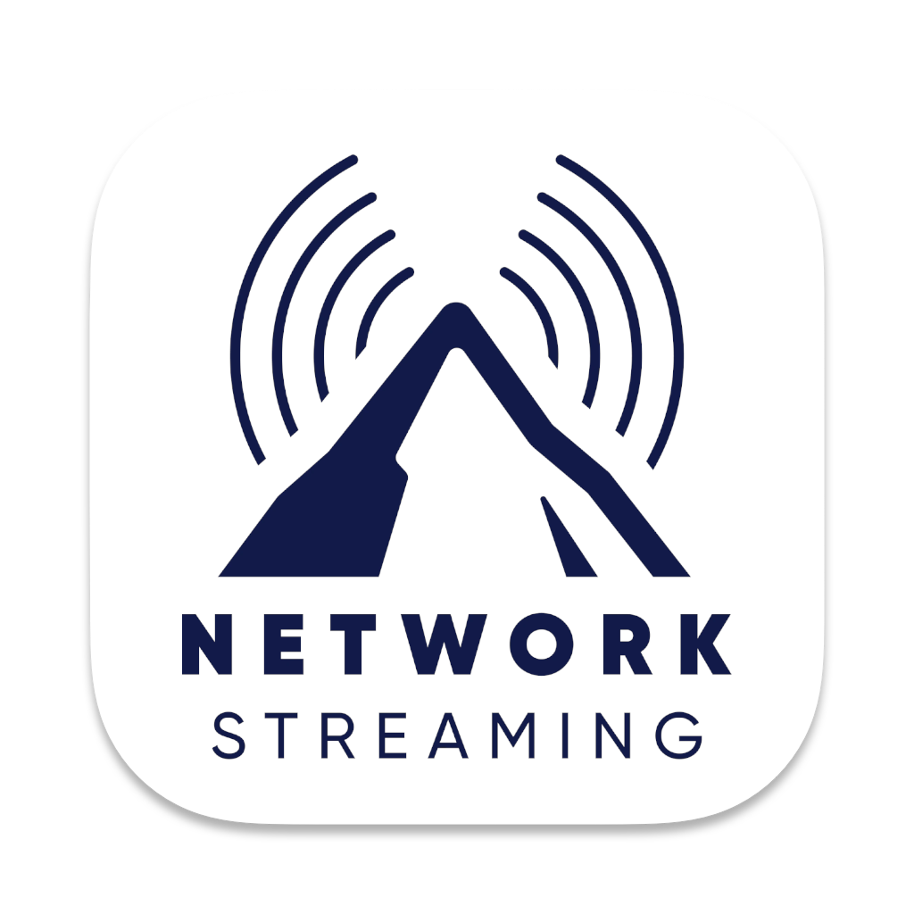

<p align="center">
   <br/>
  
  
  
  
</p>

**Carabiner** is a simple, lightweight, and easy-to-use video capture and remote control simulator app that supports Roku and Android based streaming devices (FireTV, AndroidTV and Google TV). It floats on top of other apps, so you can easily control your WCTV app while visualizes it on your computer.

It is perfect for developers and QA engineers to execute and test applications using a capture card and the computer keyboard, without the need of a TV set or a Remote control.

## Development

<p align="center">

</p>

**Carabiner** project was created during the **Paramount Network Streaming - Code Fest 2024**, and its name was inspired by one essential tool for anyone that aims to climb mountains!

### Tech Stack

- [JavaScript Language](https://developer.mozilla.org/en-US/docs/Web/JavaScript)
- [Electron Framework](https://www.electronjs.org/)
- [React Web UI Library](https://react.dev/)
- [Roku External Control Protocol (ECP)](https://developer.roku.com/docs/developer-program/dev-tools/external-control-api.md)
- [Android Debug Bridge (ADB)](https://developer.android.com/tools/adb)

## Features

[Carabiner](https://github.com/lvcabral/Carabiner) features a wide range of settings for:

- Changing the dimensions of the floating window
- Changing the transparency of the floating window
- Adding a border to the window
- Create a list of streaming devices to connect
- Overlay a picture to check "design vs app screen" for pixel perfect UI
- Configure a shortcut to save a screenshot of the floating window

### Future Improvements

- Freely resizable floating window including fullscreen support
- Configurable global shortcut to show/hide the floating window
- Record captured video to mp4/mkv file
- Detect list streaming devices in the network (SSDP)
- Link capture devices with streaming devices
- Add missing ADB keyboard mapping

## Installation

Carabiner is available on macOS, Windows and Linux. You can download it from the [releases](https://github.com/lvcabral/carabiner/releases) page.

> **Note:** Carabiner is a prototype at this point. If you find any bugs, [please raise an issue](https://github.com/lvcabral/carabiner/issues/new). Also, we don't have a code signing certificate yet, so you might have to allow the app to run on your system.

## Usage

After installing, launch and customize the settings to your liking. When you are done customizing, you can minimize the settings window and start using it or move the settings window to a different monitor.

The floating window can be moved around, resized and have its borders changed.

## Contributing

If you want to contribute to Carabiner, you can do so by:

- Reporting bugs
- Fixing bugs
- Suggesting and adding new features

## Building from source

If you want to build Carabiner from source, first ensure you have the Node.js installed (v18.0+).
Next, clone the repository and install the dependencies.

```console
git clone https://github.com/lvcabral/carabiner.git && cd carabiner && yarn install
```

To start the app, you'd need to run:

```console
yarn build && yarn forge
```

To create an installer in the platform you are running, just use:

```console
yarn make
```

The installer will be created inside the folder `./out/make`

## Reference Repositories

This app was developed borrowing ideas and code from the following repositories:

- [floatcam](https://github.com/theterminalguy/floatcam) by @theterminalguy - Main boilerplate for the settings and video screens
- [FireTVRemote-Node 🔥](https://github.com/ZaneH/firetv-remote/) by @ZaneH - Reference for ADB remote control for Android devices
- [Roku GamePad Gateway](https://github.com/lvcabral/roku-gpg) by @lvcabral - Reference for using ECP API for Roku devices

## Developer Links

- My website: [https://lvcabral.com](https://lvcabral.com)
- My threads: [@lvcabral](https://www.threads.net/@lvcabral)
- My Bluesky: [@lvcabral.com](https://bsky.app/profile/lvcabral.com)
- My X/twitter: [@lvcabral](https://twitter.com/lvcabral)
- My podcast: [PODebug Podcast](http://podebug.com)
- Check my other [GitHub repositories](https://github.com/lvcabral)

## License

Copyright © 2024 Marcelo Lv Cabral. All rights reserved.

Licensed under the [MIT](LICENSE) license.
