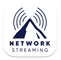

<p align="center">
   <br/><br/>
  <a href="https://github.com/lvcabral/carabiner/releases/tag/v0.3.1"></a>
  
  <a href="./LICENSE"></a>
  
</p>

**Carabiner** is a simple and easy-to-use video capture and remote control simulator app that supports Roku and Android based streaming devices (FireTV, Google TV, Android TV). It floats on top of other apps, so you can easily control your streaming app while visualizes it on your computer.

It is perfect for developers and QA engineers to execute and test applications using a capture card and the computer keyboard, without the need of a TV set or a Remote control.

## Development

<p align="center">

</p>

**Carabiner** app was created during the **Paramount Network Streaming - Code Fest 2024**, and it was elected as the **winning project**. Its name was inspired by one essential tool for anyone that aims to climb mountains!

### Tech Stack

- [JavaScript Language](https://developer.mozilla.org/en-US/docs/Web/JavaScript)
- [Electron Framework](https://www.electronjs.org/)
- [React Web UI Library](https://react.dev/)
- [Roku External Control Protocol (ECP)](https://developer.roku.com/docs/developer-program/dev-tools/external-control-api.md)
- [Android Debug Bridge (ADB)](https://developer.android.com/tools/adb)

## Features

**Carabiner** offers a wide range of features and settings:

- Freely resizable floating window including fullscreen support
- Option to select the capture device
- Option to Link a capture device with a streaming device
- Option to select the resolution of the capture device
- Option to set the transparency of the floating window
- Fully configurable border to the floating window
- Create your list of streaming devices to connect and control
- Configure the path to the ADB executable
- Overlay a picture to check "design vs app screen" for pixel perfect UI
- Configurable global shortcut to show/hide the floating window
- Dropdown menu with options to Copy and Save a screenshot of streaming display
- Option to show/hide the settings window on app start
- Option to launch the app on system login
- Option to enable/disable the always on top for the floating window

### Future Improvements

- Allow user to record captured video to mp4/mkv file
- Detect the list streaming devices in the network (SSDP)

## Installation

**Carabiner** is available on macOS, Windows and Linux. You can download the installers from the [releases](https://github.com/lvcabral/carabiner/releases) page.

### Pre-requisites

1. First time you run the app, you will need to authorize the app to have access to your camera and microphone.
2. Make sure your Roku devices have the Developer Mode enabled, see the documentation [here](https://developer.roku.com/docs/developer-program/getting-started/developer-setup.md).
3. Make sure your Fire TV and Google TV devices have the ADB Debugging enabled, see the documentation [here](https://developer.android.com/studio/command-line/adb).
4. To control Fire TV and Google TV, make sure your computer has the ADB executable installed and you configured the path in the settings. Get the latest version of the platform tools [here](https://developer.android.com/studio/releases/platform-tools.html).
5. First time you connect to your Fire TV or Google TV device, you will need to authorize the connection.

> **Note:** Carabiner is a prototype at this point. If you find any bugs, [please raise an issue](https://github.com/lvcabral/carabiner/issues/new). Also, we only have code signing certificate for MacOS, so you might have to allow the app to run on your system.

## Usage

After installing Carabiner, launch the application and customize the settings to your preferences. Once you have configured the settings, you can minimize or close the settings window and start using the floating window.

### Controlling Streaming Devices

1. **Select a Capture Device**: In the `Display` tab, select a video capture device from the list.
2. **Select a Streaming Device**: In the `Control` tab, select a streaming device from the list.
3. **Keyboard Controls**: When the floating display window is focused, you can use your keyboard to control the selected device. Refer to the [keyboard control mappings](./docs/key-mappings.md) documentation to learn how to operate your device.

### Taking Screenshots

You can take screenshots of the streaming display by clicking the settings button, in the top right corner of the floating window. It will display a dropdown menu with options to `Copy` or `Save`. The screenshot will be saved to your clipboard or the specified folder, respectively.

### Overlay Image

You can load an overlay image on top of the video capture to help you compare a screen design with the app. This feature is useful for achieving pixel-perfect UI designs.

### Additional Features

- **Transparency**: Adjust the transparency of the floating window.
- **Borders**: Add or customize the border of the floating window.
- **Always on Top**: Enable or disable the floating window to be always on top.
- **Global Shortcut**: Set a global shortcut to show/hide the floating window.

## Contributing

If you want to contribute to Carabiner, you can do so by:

- Reporting bugs
- Fixing bugs
- Suggesting and adding new features

## Building from source

If you want to build Carabiner from source, first ensure you have the Node.js installed (v18.0+).
Next, clone the repository and install the dependencies.

```console
git clone https://github.com/lvcabral/carabiner.git; cd carabiner; yarn install
```

To start the app, you'd need to run:

```console
yarn build; yarn forge
```

To create an installer in the platform you are running, just use:

```console
yarn make
```

The installer will be created inside the folder `./out/make`

## Reference Repositories

This app was developed borrowing ideas and code from the following repositories:

- [floatcam](https://github.com/theterminalguy/floatcam) by @theterminalguy - Main boilerplate for the settings and video screens
- [FireTVRemote-Node 🔥](https://github.com/ZaneH/firetv-remote/) by @ZaneH - Reference for ADB remote control for Android devices
- [Roku GamePad Gateway](https://github.com/lvcabral/roku-gpg) by @lvcabral - Reference for using ECP API for Roku devices

## Developer Links

- My website: [https://lvcabral.com](https://lvcabral.com)
- My threads: [@lvcabral](https://www.threads.net/@lvcabral)
- My Bluesky: [@lvcabral.com](https://bsky.app/profile/lvcabral.com)
- My X/twitter: [@lvcabral](https://twitter.com/lvcabral)
- My podcast: [PODebug Podcast](http://podebug.com)
- Check my other [GitHub repositories](https://github.com/lvcabral)

## License

Copyright © 2024 Marcelo Lv Cabral. All rights reserved.

Licensed under the [MIT](LICENSE) license.
