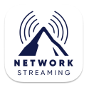

  
    
  
  
  
  

# Carabiner

**Carabiner** is a powerful video capture and remote control application designed for streaming device development and testing. It provides seamless control of Roku, Android-based streaming devices (Fire TV, Google TV, Android TV), and Apple TV through an intuitive floating window interface.

  
  <img src="https://img.shields.io/badge/Fire%20TV-FF9900?style=for-the-badge&logo=&logoColor=white" alt="Fire TV" height="40px" />
  
  
  

## Why Carabiner?

Perfect for developers and QA engineers who need to test streaming applications using capture cards and keyboard controls, eliminating the need for physical TV sets or remote controls. Whether you're developing apps, testing UI designs, or performing quality assurance, Carabiner streamlines your workflow by bringing your streaming devices directly to your desktop.

## Features

### Core Functionality

- **Multi-Device Support**: Control Roku, Android-based devices (Fire TV, Google TV, Android TV) and Apple TV
- **Real-time Video Capture**: View your streaming device output directly on your computer
- **Video Recording**: Record streaming device sessions in MP4/WebM format for documentation and testing
- **Keyboard Control**: Use your computer keyboard to navigate and control devices
- **Text Pasting**: Paste clipboard content directly to streaming devices
- **Screenshot Capture**: Save or copy screenshots with one click
- **Automation Scripts**: Record key sequences with precise timing and replay them on demand

### Additional Features

- **Overlay Images**: Load reference images for pixel-perfect UI comparison with opacity control
- **Customizable Display**: Adjust transparency, borders, dimensions and toggle always-on-top behavior
- **Global Shortcut**: Quick show/hide the display window from anywhere with a keyboard shortcut
- **Audio Capture**: Toggle audio capture for testing audio features (TTS, Audio tracks)
- **Auto-Launch**: Start with your system for seamless workflow
- **Resolution Control**: Configure capture device resolution
- **Dark Mode Support**: Allows to switch the settings interface to dark mode
- **Default Save Locations**: Configure custom default folders for screenshots and recordings in the Files tab
- **Interactive Notifications**: Click toast notifications to open saved file locations instantly

## Quick Start

1. **Download** the latest installer from the [releases page](https://github.com/lvcabral/carabiner/releases)
2. **Install** and launch Carabiner (see our [Installation Guide](./docs/installation.md))
3. **Configure** your capture device in the **General** tab
4. **Add** your streaming device in the **Control** tab
5. **Link** your devices in the **General** tab and start controlling!

For detailed setup and usage instructions, see our comprehensive guides:

- **📦 [Installation Guide](./docs/installation.md)** - Complete installation and setup instructions
- **📖 [Usage Guide](./docs/usage-guide.md)** - Detailed feature documentation and tutorials
- **🔧 [Building from Source](./docs/building-from-source.md)** - Developer setup and contribution guide
- **⌨️ [Keyboard Mappings](./docs/key-mappings.md)** - Complete keyboard control reference
- **📸 [Screenshots](./docs/screenshots.md)** - Visual showcase of the application interface
- **🤖 [Android / Fire TV Setup](./docs/setup-android-firetv.md)** - ADB setup for Fire TV and Google TV
- **🍎 [Apple TV Setup](./docs/setup-apple-tv.md)** - pyatv setup and pairing for Apple TV

## Contributing

We welcome contributions to make Carabiner better! Here's how you can help:

### Ways to Contribute

- **🐛 Report Bugs**: Found an issue? [Create a bug report](https://github.com/lvcabral/carabiner/issues)
- **💡 Suggest Features**: Have an idea? [Submit a feature request](https://github.com/lvcabral/carabiner/issues)
- **🔧 Fix Issues**: Browse [open issues](https://github.com/lvcabral/carabiner/issues) and submit pull requests
- **📖 Improve Documentation**: Help improve this README or other documentation
- **💖 Support Development**: [Donate to the developer](https://paypal.me/lvcabral)

## Technology Stack

- **[JavaScript](https://developer.mozilla.org/en-US/docs/Web/JavaScript)**: Core programming language
- **[Electron Framework](https://www.electronjs.org/)**: Cross-platform desktop application framework
- **[React](https://react.dev/)**: User interface library for the settings panel
- **[Roku External Control Protocol (ECP)](https://developer.roku.com/docs/developer-program/dev-tools/external-control-api.md)**: Roku device communication
- **[Android Debug Bridge (ADB)](https://developer.android.com/tools/adb)**: Android device communication
- **[pyatv](https://pyatv.dev/)**: Apple TV device communication via Media Remote Protocol (MRP)

## Acknowledgments

This application was built with inspiration and code from several excellent open-source projects:

- **[floatcam](https://github.com/theterminalguy/floatcam)** by @theterminalguy - Primary foundation for settings interface and video display functionality
- **[FireTVRemote-Node 🔥](https://github.com/ZaneH/firetv-remote/)** by @ZaneH - Reference implementation for ADB remote control of Android devices
- **[Roku GamePad Gateway](https://github.com/lvcabral/roku-gpg)** by @lvcabral - Reference for Roku ECP API integration

## Project Background

**Carabiner** was created during the **Paramount Network Streaming - Code Fest 2024** and was selected as the **winning project**. The name was inspired by the essential tool used by mountain climbers – just as a carabiner connects climbers to their lifeline to reach the top, this app connects developers to their streaming devices.

## Connect with the Developer

- **Website**: [https://lvcabral.com](https://lvcabral.com)
- **Threads**: [@lvcabral](https://www.threads.net/@lvcabral)
- **Bluesky**: [@lvcabral.com](https://bsky.app/profile/lvcabral.com)
- **X/Twitter**: [@lvcabral](https://twitter.com/lvcabral)
- **Podcast**: [PODebug Podcast](http://podebug.com)
- **GitHub**: [More repositories](https://github.com/lvcabral)

## License

Copyright © 2024-2026 Marcelo Lv Cabral. All rights reserved.

Licensed under the [MIT License](LICENSE).
