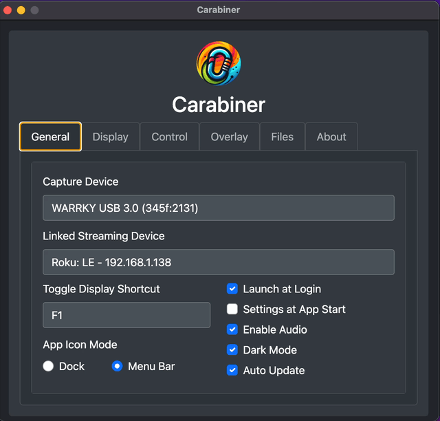

# Screenshots

This page showcases Carabiner's user interface and key features through visual examples.

## Application Interface

### Settings Window

The main settings interface provides comprehensive configuration options across multiple tabs:

**Features shown:**

- **Tabbed Interface**: General, Display, Control, Overlay, Files, and About tabs
- **Device Configuration**: Video capture device selection and streaming device management
- **Display Controls**: Resolution settings, transparency slider, and window behavior options
- **Overlay Management**: Image overlay functionality with recent files list
- **Default Save Locations**: Files tab for configuring custom screenshot and recording save paths
- **Clean Design**: Modern Bootstrap-based interface with dark mode support

### Display Window Menu

The floating display window includes an integrated settings menu for quick access to common actions:

**Features shown:**

- **Screenshot Options**: Quick copy to clipboard or save to file
- **Recording Controls**: Start/stop video recording functionality
- **Multiple Devices**: Easy access to switch between linked devices

---

For more detailed information about using these features, see our [Usage Guide](./usage-guide.md) or [Installation Guide](./installation.md).
